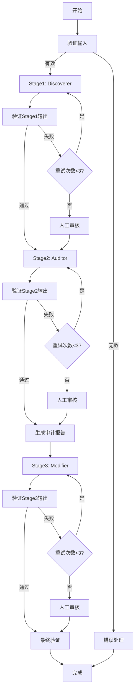

# 开发计划：剧本分析系统实现方案

## 📋 目录
1. [LangGraph架构设计](#langgraph架构设计)
2. [TDD测试驱动开发策略](#tdd测试驱动开发策略)
3. [EDD示例驱动开发策略](#edd示例驱动开发策略)
4. [验证标准与成功指标](#验证标准与成功指标)
5. [开发路线图](#开发路线图)

---

## 1. LangGraph架构设计

### 1.1 为什么选择LangGraph？

**核心优势**：
- ✅ 状态机管理：清晰的状态流转，易于调试
- ✅ 内置重试机制：处理LLM输出不稳定
- ✅ 人工介入节点：支持审核流程
- ✅ 可视化：自动生成状态图
- ✅ 持久化：支持checkpoint恢复

### 1.2 状态图设计



### 1.3 状态定义（State Schema）

```python
from typing import TypedDict, List, Optional, Literal
from prompts.schemas import (
    Script, DiscovererOutput, AuditorOutput,
    ModifierOutput, AuditReport
)

class PipelineState(TypedDict):
    """Pipeline的全局状态"""

    # 输入
    script: Script

    # Stage 1
    discoverer_output: Optional[DiscovererOutput]
    discoverer_retry_count: int
    discoverer_error: Optional[str]

    # Stage 2
    auditor_output: Optional[AuditorOutput]
    auditor_retry_count: int
    auditor_error: Optional[str]

    # Audit Report (Stage 2 -> Stage 3)
    audit_report: Optional[AuditReport]

    # Stage 3
    modifier_output: Optional[ModifierOutput]
    modifier_retry_count: int
    modifier_error: Optional[str]

    # 控制流
    current_stage: Literal["validate_input", "stage1", "stage2", "stage3", "complete", "error"]
    requires_human_review: bool
    human_review_message: Optional[str]

    # 元数据
    pipeline_start_time: float
    total_llm_calls: int
    total_tokens_used: int
```

### 1.4 节点实现（Nodes）

#### Node 1: validate_input
```python
def validate_input_node(state: PipelineState) -> PipelineState:
    """验证输入的Script是否合法"""
    try:
        # 使用Pydantic验证
        Script.model_validate(state["script"])

        # 业务逻辑验证
        errors = validate_setup_payoff_integrity(state["script"])
        if errors:
            logger.warning(f"Setup-payoff integrity issues: {errors}")

        state["current_stage"] = "stage1"
        return state
    except ValidationError as e:
        state["current_stage"] = "error"
        state["discoverer_error"] = f"Invalid input: {e}"
        return state
```

#### Node 2: stage1_discoverer
```python
def stage1_discoverer_node(state: PipelineState) -> PipelineState:
    """执行Stage1: 识别TCCs"""

    # 加载Prompt
    prompt = load_prompt("prompts/stage1_discoverer.md")

    # 调用LLM
    llm = ChatAnthropic(model="claude-sonnet-4-5", temperature=0)
    response = llm.invoke([
        {"role": "system", "content": prompt},
        {"role": "user", "content": state["script"].model_dump_json()}
    ])

    state["total_llm_calls"] += 1
    state["total_tokens_used"] += response.usage_metadata["total_tokens"]

    try:
        # 验证输出
        output = DiscovererOutput.model_validate_json(response.content)
        state["discoverer_output"] = output
        state["current_stage"] = "stage2"
        logger.info(f"Stage1 success: {len(output.tccs)} TCCs identified")
    except ValidationError as e:
        state["discoverer_retry_count"] += 1
        state["discoverer_error"] = str(e)
        logger.error(f"Stage1 validation failed (retry {state['discoverer_retry_count']}): {e}")

    return state
```

#### Node 3: validate_stage1
```python
def validate_stage1_node(state: PipelineState) -> PipelineState:
    """验证Stage1输出质量"""

    if state["discoverer_output"] is None:
        # 检查是否需要重试
        if state["discoverer_retry_count"] >= 3:
            state["requires_human_review"] = True
            state["human_review_message"] = f"Stage1 failed after 3 retries: {state['discoverer_error']}"
            logger.warning("Stage1 requires human review")
        return state

    # 质量检查
    output = state["discoverer_output"]

    # Check 1: 至少有1个TCC
    if len(output.tccs) == 0:
        state["discoverer_output"] = None
        state["discoverer_error"] = "No TCCs identified"
        state["discoverer_retry_count"] += 1
        return state

    # Check 2: Confidence不能全部过低
    avg_confidence = sum(t.confidence for t in output.tccs) / len(output.tccs)
    if avg_confidence < 0.6:
        logger.warning(f"Low average confidence: {avg_confidence}")

    # Check 3: 场景引用有效性
    all_scene_ids = {scene.scene_id for scene in state["script"].scenes}
    for tcc in output.tccs:
        invalid_scenes = [sid for sid in tcc.evidence_scenes if sid not in all_scene_ids]
        if invalid_scenes:
            state["discoverer_output"] = None
            state["discoverer_error"] = f"Invalid scene references: {invalid_scenes}"
            state["discoverer_retry_count"] += 1
            return state

    # 通过验证
    state["current_stage"] = "stage2"
    return state
```

#### 条件边（Conditional Edges）

```python
def should_retry_stage1(state: PipelineState) -> str:
    """决定是否重试Stage1"""
    if state["discoverer_output"] is not None:
        return "continue"  # 成功，进入下一阶段

    if state["discoverer_retry_count"] >= 3:
        return "human_review"  # 失败次数过多，人工审核

    return "retry"  # 重试
```

### 1.5 完整的Graph构建

```python
from langgraph.graph import StateGraph, END

def build_pipeline_graph() -> StateGraph:
    """构建完整的Pipeline状态图"""

    workflow = StateGraph(PipelineState)

    # 添加节点
    workflow.add_node("validate_input", validate_input_node)
    workflow.add_node("stage1", stage1_discoverer_node)
    workflow.add_node("validate_stage1", validate_stage1_node)
    workflow.add_node("stage2", stage2_auditor_node)
    workflow.add_node("validate_stage2", validate_stage2_node)
    workflow.add_node("generate_audit", generate_audit_report_node)
    workflow.add_node("stage3", stage3_modifier_node)
    workflow.add_node("validate_stage3", validate_stage3_node)
    workflow.add_node("final_validation", final_validation_node)
    workflow.add_node("human_review", human_review_node)

    # 设置入口
    workflow.set_entry_point("validate_input")

    # 添加边
    workflow.add_edge("validate_input", "stage1")
    workflow.add_edge("stage1", "validate_stage1")

    # 条件边：Stage1重试逻辑
    workflow.add_conditional_edges(
        "validate_stage1",
        should_retry_stage1,
        {
            "continue": "stage2",
            "retry": "stage1",
            "human_review": "human_review"
        }
    )

    # 类似地添加Stage2、Stage3的边...

    workflow.add_edge("final_validation", END)

    return workflow.compile()
```

---

## 2. TDD测试驱动开发策略

### 2.1 测试金字塔

```
         /\
        /  \
       / E2E\        5% - 端到端测试（完整Pipeline）
      /______\
     /        \
    / 集成测试 \    15% - 集成测试（多个节点协作）
   /___________\
  /             \
 /   单元测试    \  80% - 单元测试（单个节点/函数）
/________________\
```

### 2.2 单元测试（80%）

#### 2.2.1 Schema验证测试
```python
# tests/test_schemas.py
import pytest
from prompts.schemas import TCC, DiscovererOutput, ValidationError

class TestTCCSchema:
    """测试TCC数据模型"""

    def test_valid_tcc(self):
        """测试有效的TCC"""
        tcc = TCC(
            tcc_id="TCC_01",
            super_objective="玉鼠精's e-commerce plan",
            core_conflict_type="interpersonal",
            evidence_scenes=["S01", "S02"],
            confidence=0.95
        )
        assert tcc.tcc_id == "TCC_01"

    def test_invalid_tcc_id_format(self):
        """测试无效的TCC_ID格式"""
        with pytest.raises(ValidationError):
            TCC(
                tcc_id="TCC_1",  # 应该是TCC_01
                super_objective="test",
                core_conflict_type="interpersonal",
                evidence_scenes=["S01", "S02"],
                confidence=0.95
            )

    def test_invalid_confidence_range(self):
        """测试confidence超出范围"""
        with pytest.raises(ValidationError):
            TCC(
                tcc_id="TCC_01",
                super_objective="test objective",
                core_conflict_type="interpersonal",
                evidence_scenes=["S01", "S02"],
                confidence=1.5  # 应该 <= 1.0
            )

    def test_super_objective_length(self):
        """测试super_objective长度限制"""
        with pytest.raises(ValidationError):
            TCC(
                tcc_id="TCC_01",
                super_objective="short",  # 应该 >= 10 chars
                core_conflict_type="interpersonal",
                evidence_scenes=["S01", "S02"],
                confidence=0.95
            )
```

#### 2.2.2 Prompt解析测试
```python
# tests/test_prompts.py
import pytest
from src.utils.prompt_loader import load_prompt

class TestPromptLoader:
    """测试Prompt加载和解析"""

    def test_load_stage1_prompt(self):
        """测试加载Stage1 Prompt"""
        prompt = load_prompt("prompts/stage1_discoverer.md")
        assert "TCC Identification" in prompt
        assert "Output Schema" in prompt

    def test_prompt_file_not_found(self):
        """测试文件不存在"""
        with pytest.raises(FileNotFoundError):
            load_prompt("prompts/nonexistent.md")
```

#### 2.2.3 节点逻辑测试（Mock LLM）
```python
# tests/test_nodes.py
import pytest
from unittest.mock import Mock, patch
from src.nodes.discoverer import stage1_discoverer_node
from prompts.schemas import Script, PipelineState

class TestDiscovererNode:
    """测试Discoverer节点（Mock LLM）"""

    @pytest.fixture
    def sample_state(self):
        """准备测试用的State"""
        return {
            "script": Script(scenes=[...]),
            "discoverer_retry_count": 0,
            "total_llm_calls": 0,
            "total_tokens_used": 0
        }

    @patch("src.nodes.discoverer.ChatAnthropic")
    def test_stage1_success(self, mock_llm, sample_state):
        """测试Stage1成功场景"""
        # Mock LLM返回有效JSON
        mock_response = Mock()
        mock_response.content = '''
        {
          "tccs": [
            {
              "tcc_id": "TCC_01",
              "super_objective": "Test objective",
              "core_conflict_type": "interpersonal",
              "evidence_scenes": ["S01", "S02"],
              "confidence": 0.95
            }
          ],
          "metadata": {
            "total_scenes_analyzed": 10,
            "primary_evidence_available": true,
            "fallback_mode": false
          }
        }
        '''
        mock_response.usage_metadata = {"total_tokens": 1000}
        mock_llm.return_value.invoke.return_value = mock_response

        # 执行节点
        result = stage1_discoverer_node(sample_state)

        # 验证
        assert result["discoverer_output"] is not None
        assert len(result["discoverer_output"].tccs) == 1
        assert result["current_stage"] == "stage2"
        assert result["total_llm_calls"] == 1

    @patch("src.nodes.discoverer.ChatAnthropic")
    def test_stage1_validation_failure(self, mock_llm, sample_state):
        """测试Stage1输出验证失败"""
        # Mock LLM返回无效JSON
        mock_response = Mock()
        mock_response.content = '''{"invalid": "json"}'''
        mock_response.usage_metadata = {"total_tokens": 500}
        mock_llm.return_value.invoke.return_value = mock_response

        result = stage1_discoverer_node(sample_state)

        assert result["discoverer_output"] is None
        assert result["discoverer_retry_count"] == 1
        assert result["discoverer_error"] is not None
```

### 2.3 集成测试（15%）

```python
# tests/test_integration.py
import pytest
from src.pipeline import build_pipeline_graph
from prompts.schemas import Script

class TestPipelineIntegration:
    """测试多个节点的协作"""

    @pytest.fixture
    def pipeline(self):
        """构建Pipeline"""
        return build_pipeline_graph()

    def test_stage1_to_stage2_flow(self, pipeline):
        """测试Stage1到Stage2的流转"""
        initial_state = {
            "script": load_test_script("examples/simple_script.json"),
            "discoverer_retry_count": 0,
            "auditor_retry_count": 0,
            # ... 其他初始化
        }

        # 执行到Stage2
        result = pipeline.invoke(initial_state)

        # 验证Stage1输出被Stage2正确接收
        assert result["discoverer_output"] is not None
        assert result["auditor_output"] is not None
        assert result["auditor_output"].rankings.a_line is not None
```

### 2.4 E2E测试（5%）

```python
# tests/test_e2e.py
import pytest
from src.pipeline import ScriptAnalysisPipeline

class TestEndToEnd:
    """端到端测试"""

    @pytest.mark.slow
    @pytest.mark.requires_llm
    def test_complete_pipeline_simple_script(self):
        """测试完整Pipeline（单线剧本）"""
        # 加载测试剧本
        script = load_test_script("examples/single_line_script.json")

        # 执行Pipeline
        pipeline = ScriptAnalysisPipeline(api_key=TEST_API_KEY)
        result = pipeline.run(script)

        # 验证最终输出
        assert result.discoverer_output is not None
        assert len(result.discoverer_output.tccs) >= 1
        assert result.auditor_output is not None
        assert result.auditor_output.rankings.a_line is not None
        assert result.modifier_output is not None
        assert result.modifier_output.validation.fixed >= 0

    @pytest.mark.slow
    @pytest.mark.requires_llm
    def test_complete_pipeline_complex_script(self):
        """测试完整Pipeline（三线剧本）"""
        script = load_test_script("examples/three_line_script.json")

        pipeline = ScriptAnalysisPipeline(api_key=TEST_API_KEY)
        result = pipeline.run(script)

        # 验证识别出3条线
        assert len(result.discoverer_output.tccs) == 3
        assert result.auditor_output.rankings.a_line is not None
        assert len(result.auditor_output.rankings.b_lines) >= 1
```

### 2.5 测试运行策略

```bash
# 快速测试（只跑单元测试，Mock LLM）
pytest tests/ -m "not slow and not requires_llm" --cov=src --cov-report=html

# 完整测试（包含集成和E2E，调用真实LLM）
pytest tests/ --cov=src --cov-report=html

# 持续集成（CI）：只跑快速测试
pytest tests/ -m "not requires_llm" --cov=src --cov-report=xml
```

---

## 3. EDD示例驱动开发策略

### 3.1 示例剧本集（Examples Corpus）

我们需要准备以下测试剧本：

#### Example 1: 单线剧本（single_line_script.json）
```json
{
  "name": "单线剧本：简单的寻宝故事",
  "description": "只有一条主线，没有副线",
  "expected_output": {
    "tcc_count": 1,
    "a_line": "主角寻找宝藏",
    "b_lines": [],
    "c_lines": []
  },
  "scenes": [...]
}
```

#### Example 2: 双线剧本（dual_line_script.json）
```json
{
  "name": "双线剧本：外部冲突+内部冲突",
  "expected_output": {
    "tcc_count": 2,
    "a_line": "主角完成任务（外部）",
    "b_lines": ["主角克服恐惧（内部）"]
  }
}
```

#### Example 3: 三线剧本（three_line_script.json）
```json
{
  "name": "三线剧本：主线+情感线+次要线",
  "expected_output": {
    "tcc_count": 3,
    "a_line": "商业融资计划",
    "b_lines": ["身份认同危机"],
    "c_lines": ["偶像崇拜破灭"]
  }
}
```

#### Example 4: 数据缺失剧本（incomplete_data_script.json）
```json
{
  "name": "数据缺失剧本：50%场景缺少setup_payoff",
  "description": "测试fallback机制",
  "expected_output": {
    "fallback_mode": true,
    "tcc_count": ">=1"
  }
}
```

#### Example 5: 边界case剧本（edge_case_script.json）
```json
{
  "name": "边界剧本：两个TCC分数非常接近",
  "description": "测试A-line选择的tie-breaking规则",
  "expected_output": {
    "a_line_selection_reason": "drives_climax"
  }
}
```

### 3.2 示例驱动开发流程

```python
# Step 1: 写示例（Example）
example = {
    "input": load_script("examples/single_line_script.json"),
    "expected": {
        "tcc_count": 1,
        "a_line_present": True,
        "b_lines_count": 0
    }
}

# Step 2: 写测试（Test）
def test_single_line_script():
    pipeline = ScriptAnalysisPipeline()
    result = pipeline.run(example["input"])

    assert len(result.discoverer_output.tccs) == example["expected"]["tcc_count"]
    assert result.auditor_output.rankings.a_line is not None
    assert len(result.auditor_output.rankings.b_lines) == 0

# Step 3: 实现代码（Code）
# 实现能通过测试的最小代码

# Step 4: 重构（Refactor）
# 代码通过后，重构优化
```

### 3.3 Golden Dataset（黄金数据集）

创建一个包含人工标注答案的数据集：

```json
// examples/golden/百妖创业指南_ep09.json
{
  "script": {...},
  "human_annotated": {
    "tccs": [
      {
        "tcc_id": "TCC_01",
        "super_objective": "玉鼠精的电商融资计划",
        "core_conflict_type": "interpersonal",
        "evidence_scenes": ["S03", "S04", "S05", "S10", "S12"],
        "confidence": 0.95,
        "annotator": "专业编剧A",
        "notes": "主要驱动整个剧情"
      }
    ],
    "rankings": {
      "a_line": "TCC_01",
      "b_lines": ["TCC_02"],
      "c_lines": ["TCC_03"]
    },
    "issues_found": [
      {
        "issue_id": "ISS_001",
        "scene": "S20",
        "description": "S10设置了伏笔但S20未收回"
      }
    ]
  }
}
```

**用途**：
1. 回归测试：每次修改后对比Golden Dataset
2. 性能评估：计算准确率、召回率
3. A/B测试：对比不同Prompt版本

---

## 4. 验证标准与成功指标

### 4.1 功能正确性指标

#### Stage 1 (Discoverer)
| 指标 | 目标 | 测量方法 |
|------|------|---------|
| TCC识别准确率 | ≥85% | 对比Golden Dataset |
| 反镜像成功率 | 100% | 不应出现镜像TCC |
| Fallback触发率 | ≤20% | 大部分剧本应有完整数据 |
| Confidence均值 | ≥0.75 | 平均置信度 |

#### Stage 2 (Auditor)
| 指标 | 目标 | 测量方法 |
|------|------|---------|
| A-line选择正确率 | ≥90% | 对比人工标注 |
| B-line识别F1-score | ≥0.80 | 精确率+召回率 |
| 评分公式一致性 | 100% | 相同输入产生相同分数 |

#### Stage 3 (Modifier)
| 指标 | 目标 | 测量方法 |
|------|------|---------|
| Issue修复率 | ≥85% | fixed / total_issues |
| 无副作用率 | 100% | new_issues_introduced == 0 |
| Setup-payoff修复率 | ≥90% | 最常见的问题类型 |

### 4.2 性能指标

| 指标 | 目标 | 测量方法 |
|------|------|---------|
| 端到端耗时 | <120s | 50场景剧本 |
| LLM调用次数 | ≤5次 | 理想情况：3次（无重试） |
| Token使用量 | <50K tokens | 50场景剧本 |
| 内存占用 | <500MB | 峰值内存 |

### 4.3 鲁棒性指标

| 指标 | 目标 | 测量方法 |
|------|------|---------|
| 数据缺失容错率 | 100% | 不应crash |
| 重试成功率 | ≥70% | retry后成功的比例 |
| 异常恢复率 | 100% | 所有异常都应被捕获 |
| 人工审核触发率 | ≤5% | 大部分应自动完成 |

### 4.4 可观测性指标

**必须记录的数据**：
- 每个节点的执行时间
- 每次LLM调用的输入输出（LangSmith）
- 每个validation的通过/失败原因
- 重试次数和原因
- 人工审核的触发原因

**Dashboard**：
```
Pipeline执行摘要:
├─ 总耗时: 85s
├─ LLM调用: 3次
├─ Token使用: 28,500
├─ 重试次数: 0
├─ 人工审核: 否
└─ 最终结果: 成功

各阶段耗时:
├─ Stage1 (Discoverer): 25s
├─ Stage2 (Auditor): 30s
└─ Stage3 (Modifier): 20s
```

### 4.5 验证流程

```python
# 验证脚本
def validate_system():
    """运行完整验证"""

    results = {
        "functional": validate_functional_correctness(),
        "performance": validate_performance(),
        "robustness": validate_robustness()
    }

    # 生成报告
    report = generate_validation_report(results)

    # 通过标准
    if all([
        results["functional"]["discoverer_accuracy"] >= 0.85,
        results["functional"]["auditor_a_line_accuracy"] >= 0.90,
        results["functional"]["modifier_fix_rate"] >= 0.85,
        results["performance"]["avg_time"] <= 120,
        results["robustness"]["crash_rate"] == 0
    ]):
        print("✅ 系统验证通过")
        return True
    else:
        print("❌ 系统验证失败")
        print(report)
        return False
```

---

## 5. 开发路线图

### Phase 1: 基础设施（Week 1）
**目标**：搭建可运行的骨架

- [ ] **Day 1-2**: 创建项目结构
  - 创建src/目录结构
  - 配置pytest
  - 配置pre-commit hooks
  - 编写.gitignore

- [ ] **Day 3-4**: 实现基础工具类
  - PromptLoader（加载Prompt文件）
  - LLMClient（封装Anthropic API调用）
  - Logger（结构化日志）

- [ ] **Day 5**: 创建测试示例
  - 准备5个测试剧本JSON
  - 编写Schema验证测试
  - 测试覆盖率>80%

**交付物**：
- ✅ 可运行的测试套件
- ✅ 5个测试剧本
- ✅ 基础工具类

**验证标准**：
```bash
pytest tests/ -v
# 所有测试通过（虽然功能还是空的）
```

### Phase 2: Stage 1 实现（Week 2）
**目标**：实现并测试Discoverer

- [ ] **Day 1-2**: TDD实现DiscovererNode
  - 先写测试（mock LLM）
  - 实现节点逻辑
  - 实现验证逻辑

- [ ] **Day 3**: 集成真实LLM测试
  - 用5个测试剧本运行
  - 调试Prompt（如果准确率<85%）
  - 记录问题并优化

- [ ] **Day 4-5**: 重试和容错机制
  - 实现重试逻辑
  - 实现fallback机制
  - 测试边界条件

**交付物**：
- ✅ DiscovererNode完整实现
- ✅ 单元测试覆盖率>90%
- ✅ 在Golden Dataset上准确率≥85%

**验证标准**：
```python
# 所有单元测试通过
pytest tests/test_discoverer.py -v

# Golden Dataset验证
python scripts/validate_discoverer.py
# Output: Accuracy: 87% ✅
```

### Phase 3: Stage 2 实现（Week 3）
**目标**：实现并测试Auditor

- [ ] **Day 1-2**: TDD实现AuditorNode
  - 实现评分公式
  - 实现排序逻辑
  - 实现Forces分析

- [ ] **Day 3**: 集成测试
  - Stage1 -> Stage2流转
  - 验证A-line选择正确性
  - 优化评分权重

- [ ] **Day 4-5**: Edge case处理
  - 只有1个TCC
  - 两个TCC分数相同
  - 没有明显B-line

**交付物**：
- ✅ AuditorNode完整实现
- ✅ A-line选择正确率≥90%
- ✅ B-line F1-score≥0.80

### Phase 4: Stage 3 实现（Week 4）
**目标**：实现并测试Modifier

- [ ] **Day 1-3**: TDD实现ModifierNode
  - 实现各类Issue的fix逻辑
  - 实现modification log
  - 实现冲突处理

- [ ] **Day 4**: 生成Audit Report
  - 从Stage2输出推断Issues
  - 实现Issue生成逻辑

- [ ] **Day 5**: 验证和优化
  - 测试修复率
  - 确保无副作用

**交付物**：
- ✅ ModifierNode完整实现
- ✅ Issue修复率≥85%
- ✅ 无副作用率100%

### Phase 5: Pipeline集成（Week 5）
**目标**：完整的LangGraph Pipeline

- [ ] **Day 1-2**: 构建StateGraph
  - 实现所有节点
  - 实现条件边
  - 实现人工审核节点（可选）

- [ ] **Day 3-4**: E2E测试
  - 5个测试剧本完整运行
  - 性能测试
  - 鲁棒性测试

- [ ] **Day 5**: 可观测性
  - 集成LangSmith
  - 添加详细日志
  - 生成执行报告

**交付物**：
- ✅ 完整的Pipeline
- ✅ E2E测试通过
- ✅ 可观测性集成

**验证标准**：
```python
# 完整Pipeline测试
pytest tests/test_e2e.py -v --requires-llm

# 性能测试
python scripts/benchmark.py
# Output: 平均耗时: 92s ✅
```

### Phase 6: 优化与交付（Week 6）
**目标**：优化性能，准备交付

- [ ] **Day 1-2**: 性能优化
  - Prompt压缩（减少token）
  - 并行化（如果可能）
  - 缓存机制

- [ ] **Day 3**: 文档完善
  - API文档
  - 使用示例
  - 故障排除指南

- [ ] **Day 4-5**: Golden Dataset验证
  - 在10个人工标注剧本上验证
  - 生成验证报告
  - 与业务团队review

**交付物**：
- ✅ 性能达标（<120s）
- ✅ 完整文档
- ✅ 验证报告

---

## 6. 持续集成配置

```yaml
# .github/workflows/ci.yml
name: CI

on: [push, pull_request]

jobs:
  test:
    runs-on: ubuntu-latest
    steps:
      - uses: actions/checkout@v2
      - name: Set up Python
        uses: actions/setup-python@v2
        with:
          python-version: '3.11'

      - name: Install dependencies
        run: |
          pip install -r requirements.txt
          pip install pytest pytest-cov

      - name: Run unit tests (no LLM)
        run: |
          pytest tests/ -m "not requires_llm" --cov=src --cov-report=xml

      - name: Upload coverage
        uses: codecov/codecov-action@v2
        with:
          file: ./coverage.xml
```

---

## 7. 风险评估与缓解

| 风险 | 概率 | 影响 | 缓解措施 |
|------|------|------|---------|
| LLM输出不稳定 | 高 | 高 | 重试机制+温度参数=0 |
| Golden Dataset不足 | 中 | 高 | 提前准备10个标注剧本 |
| 性能不达标 | 中 | 中 | Prompt优化+并行化 |
| Prompt需要频繁调整 | 高 | 中 | 版本控制+A/B测试 |
| 人工审核流程不明确 | 低 | 低 | 先实现自动化，后续加审核 |

---

## 总结

### 为什么这个方案可行？

1. **LangGraph的优势**：
   - 状态管理清晰
   - 重试机制内置
   - 可视化调试
   - 支持人工介入

2. **TDD保证质量**：
   - 测试先行
   - 高覆盖率
   - 快速反馈

3. **EDD保证实用**：
   - 示例驱动
   - Golden Dataset验证
   - 真实场景测试

4. **明确的验证标准**：
   - 功能、性能、鲁棒性三维度
   - 量化指标
   - 自动化验证

### 下一步行动

如果你认可这个方案，我们可以：
1. **Phase 1（本周）**：搭建基础设施
2. **Phase 2（下周）**：实现Stage 1

**第一个具体任务**：
- 创建5个测试剧本JSON
- 编写pytest配置
- 实现PromptLoader工具类

你觉得这个方案如何？有哪些地方需要调整？
