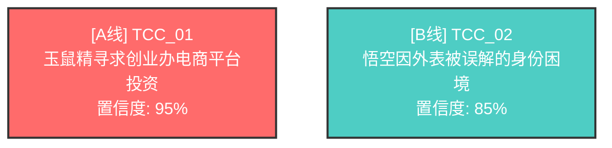

# 📄 报告导出功能使用指南

## 概述

剧本叙事结构分析系统的报告导出功能（v2.3.0）提供了专业的Markdown格式分析报告和Mermaid可视化图表，让您可以轻松分享和查看分析结果。

### 核心特性

✅ **Markdown格式报告**
- 完整的分析结果（基本信息、三阶段详细输出）
- 清晰的层次结构和格式化
- 支持GitHub、Obsidian、Typora等工具

✅ **Mermaid流程图**
- 自动生成TCC关系可视化
- A/B/C线颜色编码（红色/青色/绿色）
- Setup-Payoff因果链显示

✅ **智能分析**
- 自动生成关键发现
- 智能提供优化建议
- 性能指标统计

---

## 快速开始

### 基本用法

```bash
# 分析剧本并导出Markdown报告
python -m src.cli analyze script.json --export reports/analysis.md
```

### 完整示例

```bash
# 1. 分析剧本并导出报告
python -m src.cli analyze examples/golden/百妖_ep09_s01-s05.json \
  --export reports/百妖_analysis.md

# 2. 查看报告
cat reports/百妖_analysis.md

# 或在支持Markdown的编辑器中打开
code reports/百妖_analysis.md  # VS Code
obsidian reports/百妖_analysis.md  # Obsidian
typora reports/百妖_analysis.md  # Typora
```

---

## 报告结构

### 1. 基本信息

```markdown
## 📋 基本信息

- **剧本名称**: 百妖_ep09_s01-s05
- **分析时间**: 2025-11-13 15:10:53
- **系统版本**: v2.3.0
- **分析模式**: DeepSeek / deepseek-chat
```

包含：
- 剧本名称（从文件名或JSON中提取）
- 分析时间戳
- 系统版本号
- 使用的LLM提供商和模型

### 2. 执行概况

```markdown
## 📊 执行概况

| 指标 | 数值 |
|------|------|
| 总执行时间 | 138.95秒 |
| LLM调用次数 | 3次 |
| 重试次数 | 0次 |
| 成功率 | 100% |
```

显示关键性能指标：
- 总执行时间（秒）
- LLM API调用次数
- 重试次数（失败重试统计）
- 成功率（100% = 无错误）

### 3. 阶段一：TCC识别

```markdown
## 🔍 阶段一：戏剧冲突链（TCC）识别

**识别结果**: 共识别出 **2** 个独立的戏剧冲突链

### TCC_01: 玉鼠精寻求创业办电商平台投资

- **核心冲突类型**: interpersonal
- **置信度**: 95%
- **证据场景**: S01, S03, S04, S05

**冲突描述**:
玉鼠精试图获得创业办投资，但遭到悟空的尽职调查和质疑...

**驱动力 (Protagonist)**:
- 玉鼠精的商业野心
- 电商平台融资需求

**阻抗力 (Antagonist)**:
- 悟空的尽职调查
- 哪吒的内部爆料
- 神秘仓库问题
```

详细展示每个TCC：
- TCC编号和超级目标
- 核心冲突类型（interpersonal/internal/philosophical）
- 置信度（0-100%）
- 涉及的场景列表
- 冲突描述
- 驱动力和阻抗力分析
- Setup-Payoff因果链（如果有）

### 4. 阶段二：A/B/C线分级

```markdown
## 📊 阶段二：A/B/C线分级

### A线（主线 / Spine）

**TCC_01**: 玉鼠精寻求创业办电商平台投资

- **Spine评分**: 10.5 / 10
- **失败赌注**: 投资失败，电商平台无法启动
- **篇幅占比**: 4个场景

**评估理由**:
scene_count=4 setup_payoff_density=1.0 drives_climax=False

**驱动力**: 玉鼠精的商业野心

**主要阻抗力**: 悟空的尽职调查

**动态阻抗力**:
- 哪吒的内部爆料
- 神秘仓库问题
```

展示A/B/C线分级结果：
- **A线（主线）**: Spine评分、失败赌注、篇幅占比
- **B线（副线）**: Heart评分、情感核心、对A线的影响
- **C线（次线）**: Flavor评分、主题映照、可剥离性

### 5. 阶段三：结构修正

```markdown
## 🔧 阶段三：结构修正

### 修正概况

- **发现问题**: 4个
- **已修复**: 2个
- **跳过**: 0个

### 修正详情

#### 修正 1: ISS_001

**场景**: S02

**字段**: setup_payoff.setup_for

**修正操作**: remove

**原因**:
Removed reference to non-existent scene S43

**原值**: ['S43']

**状态**: ✅ 已应用
```

详细记录所有结构修正：
- 修正概况统计
- 每个修正的详细信息：
  - 问题编号
  - 涉及场景
  - 修改字段
  - 修正操作（add/remove/update）
  - 修正原因
  - 原值和新值
  - 应用状态

### 6. TCC关系可视化

````markdown
## 📈 TCC关系可视化



### 图例说明

- 🔴 **A线** (红色): 主线故事，剧本脊柱
- 🔵 **B线** (青色): 副线故事，情感核心
- 🟢 **C线** (绿色): 次线故事，主题映照
- ➡️ **箭头**: Setup-Payoff 因果关系
````

**Mermaid图表特性**：
- 自动生成TCC节点
- 颜色编码区分A/B/C线
- 显示置信度
- 展示Setup-Payoff关系
- 支持GitHub、Obsidian、Typora等工具渲染

**颜色方案**：
- **A线（红色 #ff6b6b）**: 主线，剧本脊柱
- **B线（青色 #4ecdc4）**: 副线，情感核心
- **C线（绿色 #95e1d3）**: 次线，主题映照

### 7. 关键发现

```markdown
## 💡 关键发现

1. 剧本采用双线叙事，主副线并行发展
2. 主线（A线）明确：玉鼠精寻求创业办电商平台投资...
3. 副线（B线）数量: 1条，提供情感深度
4. 发现4个结构性问题，已修复2个
```

智能生成的关键发现：
- 叙事结构类型（单线/双线/多线）
- 主线描述
- 副线/次线数量统计
- 结构问题概况

### 8. 建议

```markdown
## 🎯 建议

1. 剧本结构良好，建议维持当前设计
2. 可考虑进一步深化角色冲突和情感弧线
```

智能生成的优化建议：
- 结构评估
- B线建议（如果缺失）
- 低置信度TCC警告
- 结构性问题改进建议

### 9. 附录

```markdown
## 📝 附录

### 性能统计

#### 各阶段耗时

| 阶段 | 耗时 | LLM调用 | 重试次数 |
|------|------|---------|----------|
| stage1_discoverer | 45.23s | 1 | 0 |
| stage2_auditor | 52.11s | 1 | 0 |
| stage3_modifier | 41.61s | 1 | 0 |

---

**报告生成时间**: 2025-11-13 15:10:53

**系统**: 剧本叙事结构分析系统 v2.3.0

---

*本报告由 AI 自动生成，建议结合人工审核使用*
```

附录信息：
- 各阶段性能统计（耗时、LLM调用、重试）
- 报告生成时间
- 系统版本
- 免责声明

---

## 查看和分享报告

### GitHub查看

Markdown报告在GitHub上自动渲染，包括Mermaid图表：

1. 提交报告到Git仓库：
```bash
git add reports/analysis.md
git commit -m "docs: add screenplay analysis report"
git push
```

2. 在GitHub Web界面查看，Mermaid图表会自动渲染。

### Obsidian查看

Obsidian原生支持Markdown和Mermaid：

1. 将`reports/`目录添加到Obsidian vault
2. 打开报告文件
3. Mermaid图表自动渲染

### Typora查看

Typora提供所见即所得的Markdown编辑：

```bash
typora reports/analysis.md
```

### VS Code查看

使用Markdown预览：

1. 安装"Markdown Preview Mermaid Support"扩展
2. 打开报告文件
3. 按`Ctrl+Shift+V`（Windows/Linux）或`Cmd+Shift+V`（Mac）预览

---

## 高级用法

### 自定义输出路径

```bash
# 指定输出目录和文件名
python -m src.cli analyze script.json \
  --export reports/custom_name.md
```

### 与JSON输出结合

```bash
# 同时导出JSON和Markdown
python -m src.cli analyze script.json \
  --output results.json \
  --export reports/analysis.md
```

### 批量处理

```bash
# 分析多个剧本并生成报告
for script in examples/golden/*.json; do
  name=$(basename "$script" .json)
  python -m src.cli analyze "$script" \
    --export "reports/${name}_analysis.md"
done
```

---

## 报告定制

### 修改模板

如果需要自定义报告格式，可以编辑Jinja2模板：

**模板位置**: `templates/report_template.md.j2`

**示例：添加自定义章节**

```jinja2
## 🎨 自定义章节

这是一个自定义章节的示例。

### 统计数据

- 场景总数: {{ script_json.scenes|length }}
- TCC总数: {{ tccs|length }}
```

### 修改颜色方案

编辑`src/exporters/mermaid_generator.py`中的`LINE_COLORS`字典：

```python
LINE_COLORS = {
    "A": "#ff6b6b",  # 红色 - 主线
    "B": "#4ecdc4",  # 青色 - 副线
    "C": "#95e1d3",  # 绿色 - 次线
}
```

### 自定义关键发现逻辑

编辑`src/exporters/markdown_exporter.py`中的`_generate_key_findings()`方法：

```python
def _generate_key_findings(self, tccs, rankings, modifications):
    findings = []
    # 添加自定义逻辑
    findings.append("您的自定义发现")
    return findings
```

---

## 故障排除

### 问题：Mermaid图表无法渲染

**症状**：在某些Markdown查看器中看到代码块而非图表

**解决方案**：
1. 确认查看器支持Mermaid（GitHub、Obsidian、Typora支持）
2. VS Code用户：安装"Markdown Preview Mermaid Support"扩展
3. 在线查看：使用 https://mermaid.live/ 粘贴图表代码

### 问题：中文显示乱码

**症状**：报告中的中文字符显示为乱码

**解决方案**：
1. 确认文件使用UTF-8编码保存
2. 查看器设置为UTF-8编码
3. 终端环境变量设置：
```bash
export LANG=zh_CN.UTF-8
export LC_ALL=zh_CN.UTF-8
```

### 问题：导出失败

**症状**：命令执行后报错或无输出

**解决方案**：
1. 检查输出目录是否存在（自动创建）
2. 检查是否有写入权限
3. 查看详细错误信息：
```bash
python -m src.cli analyze script.json --export report.md 2>&1 | tee error.log
```

### 问题：报告内容不完整

**症状**：某些章节为空或显示"无"

**原因**：分析结果本身可能没有该部分数据（如未识别到C线）

**这是正常的**：并非所有剧本都有A/B/C三线。

---

## 最佳实践

### 1. 报告命名规范

建议使用描述性文件名：

```bash
# 好的命名
reports/百妖_ep09_s01-s05_analysis_2025-11-13.md
reports/script_v2_structure_report.md

# 避免使用
reports/report.md  # 太通用
reports/1.md  # 无意义
```

### 2. 版本控制

将报告纳入Git版本控制：

```bash
# .gitignore
# 临时JSON结果可忽略
results/*.json

# 但保留报告
!reports/*.md
```

### 3. 报告审查流程

1. **自动生成报告**
```bash
python -m src.cli analyze script.json --export reports/draft.md
```

2. **人工审核**
- 检查关键发现是否合理
- 验证A/B/C线分级是否符合预期
- 确认修正建议是否可接受

3. **最终确认**
```bash
# 重命名为最终版本
mv reports/draft.md reports/final_analysis.md
```

### 4. 团队协作

在团队中分享报告：

```bash
# 1. 生成报告
python -m src.cli analyze script.json --export reports/analysis.md

# 2. 提交到Git
git add reports/analysis.md
git commit -m "docs: add analysis report for script v1.2"
git push

# 3. 创建Pull Request
gh pr create --title "剧本结构分析报告" --body "请审阅attached报告"
```

---

## API使用

除了CLI，您也可以在Python代码中使用导出功能：

```python
from pathlib import Path
from src.pipeline import run_pipeline
from src.exporters import MarkdownExporter
from prompts.schemas import Script

# 1. 加载剧本
with open("script.json", "r", encoding="utf-8") as f:
    script_data = json.load(f)
script = Script(**script_data)

# 2. 运行分析
final_state = run_pipeline(script, provider="deepseek")

# 3. 导出报告
exporter = MarkdownExporter()

result = {
    "tccs": final_state["discoverer_output"].tccs,
    "rankings": final_state["auditor_output"].rankings,
    "modifications": {
        "modifications": final_state["modifier_output"].modification_log,
        "total_issues": final_state["modifier_output"].validation.total_issues,
    },
    "_metrics": final_state.get("_metrics", {}),
    "script_json": script_data,
}

output_path = exporter.export(
    result=result,
    output_path=Path("reports/analysis.md"),
    script_name="我的剧本"
)

print(f"报告已导出到: {output_path}")
```

---

## 相关资源

- **项目主文档**: [README.md](../README.md)
- **API参考**: [ref/api-reference.md](../ref/api-reference.md)
- **使用指南**: [USAGE.md](../USAGE.md)
- **Mermaid文档**: https://mermaid.js.org/
- **Jinja2文档**: https://jinja.palletsprojects.com/

---

## 总结

报告导出功能（v2.3.0）为剧本叙事结构分析系统提供了完整的交付能力：

✅ **专业格式** - Markdown + Mermaid可视化
✅ **自动生成** - 无需手工整理
✅ **易于分享** - GitHub/Obsidian/Typora原生支持
✅ **完整信息** - 三阶段结果 + 性能指标 + 智能建议

现在您可以：
1. 一键生成专业分析报告
2. 可视化理解TCC关系
3. 轻松分享给团队成员
4. 跟踪分析历史和版本

**开始使用**：
```bash
python -m src.cli analyze your_script.json --export reports/analysis.md
```

祝您使用愉快！🎉
